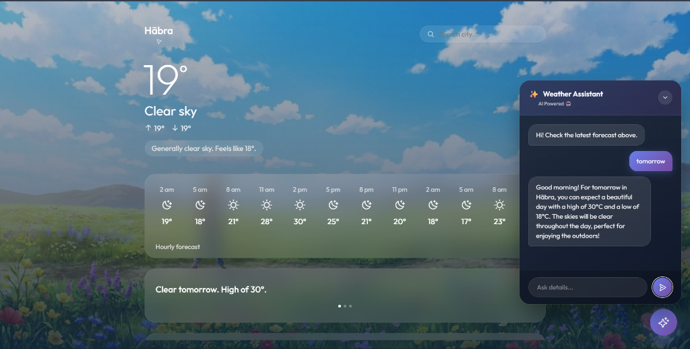

# 🌤️ AI-Powered Weather App

A beautiful, modern weather application with AI-powered chat assistant. Get real-time weather data, forecasts, and intelligent weather insights through natural conversation.



## ✨ Features

### 🌡️ Real-Time Weather Data

- Current temperature with feels-like sensation
- Dynamic weather conditions and descriptions
- High/Low temperature for the day
- Humidity, wind speed, and direction
- Dew point with comfort levels
- UV index with safety recommendations

### 📅 Comprehensive Forecasts

- **Hourly Forecast**: 24-hour temperature and condition preview
- **5-Day Forecast**: Extended outlook with daily highs/lows
- **Tomorrow's Outlook**: Quick summary of next day's weather

### 🌬️ Environmental Data

- **Air Quality Index (AQI)**: Real-time air pollution levels
- **Pollen Levels**: Estimated tree, grass, and ragweed pollen
- **UV Index**: With safety recommendations

### 🤖 AI Weather Assistant

- Powered by **Google Gemini 2.5 Flash**
- Natural language weather queries
- Context-aware responses using real-time weather data
- Markdown-formatted responses for better readability
- Personalized recommendations based on conditions

### 🎨 Modern UI/UX

- Beautiful glassmorphism design
- Dynamic weather-based backgrounds
- Smooth animations and transitions
- Fully responsive (mobile, tablet, desktop)
- Dark mode optimized

## 🛠️ Tech Stack

| Technology             | Purpose                            |
| ---------------------- | ---------------------------------- |
| **HTML5**              | Structure                          |
| **CSS3**               | Styling with glassmorphism effects |
| **Vanilla JavaScript** | Core functionality                 |
| **Vite**               | Build tool & dev server            |
| **OpenWeatherMap API** | Weather data                       |
| **Google Gemini API**  | AI chat assistant                  |
| **Phosphor Icons**     | Beautiful iconography              |

## 🚀 Getting Started

### Prerequisites

- Node.js 18+ installed
- OpenWeatherMap API key ([Get free key](https://openweathermap.org/api))
- Google Gemini API key ([Get free key](https://ai.google.dev/))

### Installation

1. **Clone the repository**

   ```bash
   git clone https://github.com/yourusername/AI-Powered-Weather-app.git
   cd AI-Powered-Weather-app
   ```

2. **Install dependencies**

   ```bash
   npm install
   ```

3. **Configure environment variables**

   Create a `.env` file in the root directory:

   ```env
   VITE_OPENWEATHER_API_KEY=your_openweather_api_key_here
   VITE_GEMINI_API_KEY=your_gemini_api_key_here
   ```

4. **Start the development server**

   ```bash
   npm run dev
   ```

5. **Open in browser**

   Navigate to `http://localhost:5173`

## 📱 Features Breakdown

### Weather Dashboard

| Widget    | Description                         |
| --------- | ----------------------------------- |
| Hero      | City name, current temp, conditions |
| Hourly    | Scrollable 24-hour forecast         |
| Daily     | 5-day forecast with icons           |
| Outlook   | Tomorrow's weather summary          |
| Running   | Activity recommendation             |
| AQI       | Air quality with visual bar         |
| Pollen    | Tree, grass, ragweed levels         |
| UV Index  | Level with safety tips              |
| Humidity  | Percentage with description         |
| Wind      | Speed, direction, compass           |
| Dew Point | Temperature with comfort level      |

### AI Chat Assistant

Ask questions like:

- "What's the weather like today?"
- "Will it rain tomorrow?"
- "Should I bring an umbrella?"
- "What's the air quality?"
- "Is it good weather for running?"

## 🎯 API Endpoints Used

| Endpoint           | Purpose                    |
| ------------------ | -------------------------- |
| `/weather`         | Current weather conditions |
| `/forecast`        | 5-day / 3-hour forecast    |
| `/air_pollution`   | Air quality index          |
| `gemini-2.5-flash` | AI chat responses          |

## 📂 Project Structure

```
AI-Powered-Weather-app/
├── index.html          # Main HTML structure
├── styles.css          # All styling (glassmorphism, responsive)
├── script.js           # Core JavaScript logic
├── package.json        # Dependencies & scripts
├── vite.config.js      # Vite configuration
├── .env                # API keys (not committed)
├── demo.png            # App screenshot
└── README.md           # This file
```

## 🤝 Contributing

Contributions are welcome! Please feel free to submit a Pull Request.

1. Fork the repository
2. Create your feature branch (`git checkout -b feature/AmazingFeature`)
3. Commit your changes (`git commit -m 'Add some AmazingFeature'`)
4. Push to the branch (`git push origin feature/AmazingFeature`)
5. Open a Pull Request

## 📄 License

This project is licensed under the MIT License - see the [LICENSE](LICENSE) file for details.

## 🙏 Acknowledgments

- [OpenWeatherMap](https://openweathermap.org/) for weather data
- [Google Gemini](https://ai.google.dev/) for AI capabilities
- [Phosphor Icons](https://phosphoricons.com/) for beautiful icons
- Weather backgrounds from Unsplash

---

<div align="center">
  <p>Made with ❤️ by <a href="https://github.com/Md-Arif-hasnat99">Md Arif Hasnat</a></p>
  <p>⭐ Star this repo if you find it useful!</p>
</div>
